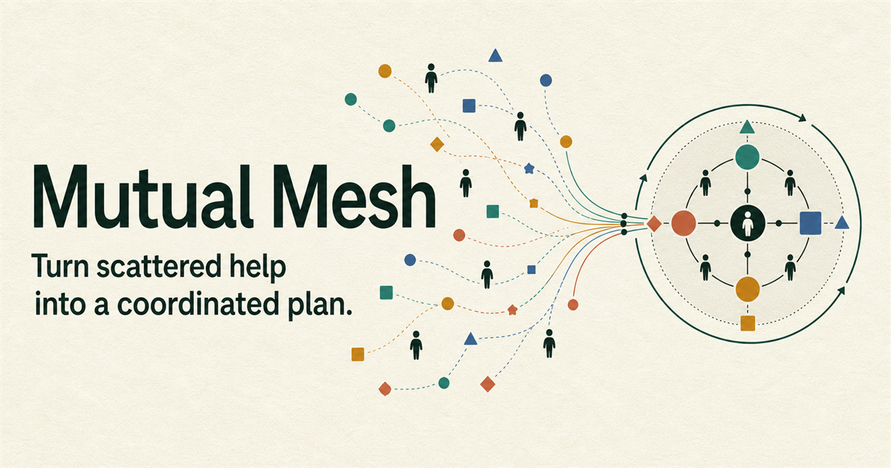

# Mutual Mesh

**Turn scattered help into a coordinated plan.** Mutual Mesh is a shared human-agent coordination canvas for assembling community goals, contributions, constraints, consent, and change into one visible, version-safe plan.



- **Live app:** [mutual-mesh.kccdv717.chatgpt.site](https://mutual-mesh.kccdv717.chatgpt.site/)
- **Source:** [github.com/nafiyad/mutual-mesh](https://github.com/nafiyad/mutual-mesh)
- **Demo video:** public YouTube upload pending; the finished recording plan is in [DEMO_SCRIPT.md](DEMO_SCRIPT.md).

## Try it with an agent

Open the live URL directly in ChatGPT's in-app browser or Chrome with WebMCP enabled, reset the demo, then use:

> Inspect this Career Night workspace. Close the equipment-pickup gap without changing any locked constraint. Preview Maya's projector becoming unavailable, repair the plan with a viable alternative, and validate the result. Keep commitment requests and publication as separate steps; do not publish yet.

Then continue with:

> Request the fictional in-app commitments. Publish the exact accepted version only after every required response is accepted.

The complete experience is also operable through the normal interface when WebMCP is unavailable.

## The problem

Community projects often have enough goodwill but no reliable way to combine people, spaces, equipment, schedules, capacity, accessibility, budget, dependencies, and consent. The facts are scattered across messages and spreadsheets, while an ordinary browser agent must infer their meaning and side effects from UI labels.

Mutual Mesh makes the website itself the coordination authority. A human locks goals and constraints. An agent can inspect compatible combinations, draft or repair a dependency graph, and receive deterministic validation results. Every change appears on the same page, records an actor and version, and stays within explicit consent and publication gates.

## Why WebMCP

This is more than button automation. Mutual Mesh exposes domain operations—searching contributions, inspecting a task graph, validating constraints, previewing disruption, requesting simulated consent, and publishing one accepted version—as typed browser tools. That gives an agent precise live state and bounded actions while the human watches the same canvas.

WebMCP makes four UX improvements central to the product:

1. **No guessing:** tool inputs use stable IDs, strict schemas, and plain-language recovery errors.
2. **One shared state:** human controls and site tools call the same domain services and versioned local store.
3. **Safe sequencing:** preview, draft, consent request, acceptance, and publication are distinct states.
4. **Visible proof:** every successful mutation updates the canvas and activity trail; stale writes change nothing.

## Nine site tools

| Tool | Kind | Visible effect and boundary |
| --- | --- | --- |
| `get_coordination_context` | Read | Reads the goal, locked constraints, summary, gaps, commitments, and safe next operations. |
| `search_contributions` | Read | Filters people and resources by capability, kind, time, availability, capacity, cost, and accessibility. |
| `inspect_plan` | Read | Reads the current versioned graph, assignments, costs, gaps, commitments, rationale, and last change. |
| `validate_plan` | Read | Runs deterministic integrity, availability, timing, capacity, accessibility, workload, budget, dependency, consent, and publication checks. |
| `draft_coordination_plan` | Write | Replaces only the unpublished draft; never contacts anyone or publishes. |
| `revise_coordination_plan` | Write | Applies up to ten draft operations atomically against an exact version. |
| `preview_disruption` | Preview | Shows impact and alternatives without changing the canonical plan version. |
| `request_commitments` | Write | Creates fictional in-app requests only; sends no email, SMS, invitation, or external message. |
| `publish_coordination_plan` | Write | Creates an immutable in-app snapshot only after validation and every required acceptance pass. |

The imperative registration is easy to audit in [webmcp/registerTools.ts](webmcp/registerTools.ts):

```ts
await document.modelContext.registerTool({
  name: 'search_contributions',
  description: 'Find viable people and resources using bounded filters.',
  inputSchema: {
    type: 'object',
    properties: { capabilityQuery: { type: 'string' } },
    additionalProperties: false,
  },
  annotations: { readOnlyHint: true },
  execute: async (input) => handlers.searchContributions(input),
});
```

See [WEBMCP.md](WEBMCP.md) for schemas, lifecycle, safety boundaries, and contract-test details.

## Canonical demo

The deterministic Career Night story starts with seven covered tasks and one equipment-pickup gap:

1. Find Carlos, preview the assignment, and apply draft v4.
2. Preview Maya's projector cancellation; the plan remains v4.
3. Repair AV with Priya's portable display and adapter; draft v5 is valid.
4. Validate budget, accessibility, capacity, workload, timing, dependencies, and coverage.
5. Create seven fictional in-app commitment requests. No external communication occurs.
6. Simulate acceptance, then publish immutable plan v5.
7. Inspect the human, agent, and system activity trail or reset and replay.

The UI also includes a simulated-decline branch that blocks publication and requires a new draft.

## Architecture

```text
Human UI ──────────────┐
                      ├── domain services ── invariants + validation ── versioned store
WebMCP tool handlers ─┘                                              ├── visible graph
                                                                    └── activity trail
```

- `app/` — responsive canvas, graph fallback table, inspector, demo controls, metadata, and the production design-system layer
- `data/` — deterministic fictional Career Night seed
- `domain/` — shared types, invariants, scoring, and validation
- `services/` — transactional planning, disruption, consent, and publication operations
- `store/` — versioned device-local persistence and reset boundary
- `webmcp/` — strict schemas, handlers, browser API types, catalog, and registration lifecycle
- `test/` — unit, interaction, and mocked-agent contract tests
- `e2e/` — Chromium acceptance path through the normal UI

## Run locally

Requires Node.js 22.13 or newer.

```bash
npm ci
npm run dev
```

Open `http://localhost:3000`.

## Quality gates

```bash
npm test
npm run test:e2e
npm run lint
npx tsc --noEmit
npm run build
```

The repository runs the same gates in GitHub Actions. The automated suite covers stale versions, strict schemas, atomic writes, disruption previews, declined commitments, publication immutability, mocked agent discovery, the complete human flow, and abort-driven tool cleanup.

## Compatible-browser verification

1. Open the HTTPS deployment directly in ChatGPT's in-app browser, which provides WebMCP support, or use a WebMCP-enabled Chrome build.
2. Reset the demo.
3. Open the status badge and verify **nine tools**: four reads and five preview/write actions.
4. Run the canonical prompt and confirm the graph, plan version, activity, and tool-call status change visibly.
5. Repeat the normal UI path to verify graceful fallback.

## Security, privacy, and limitations

- Every person, contribution, commitment, and event in the demo is fictional.
- State stays in device-local browser storage; there is no account, server database, analytics, or API key.
- Every JSON Schema is closed with `additionalProperties: false`; every handler re-validates input with Zod.
- Writes require the exact inspected plan version. Stale, invalid, oversized, incompatible, or published-plan mutations are rejected without partial state changes.
- Commitment requests, responses, and publication are simulated inside the app. No external messages or real-world actions occur.
- Mutual Mesh is a coordination prototype, not an emergency-response service.

## Project documents

- [MASTER_PLAN.md](MASTER_PLAN.md) — product thesis, scope, release gates, and completion status
- [DESIGN.md](DESIGN.md) — visual direction, layout rules, typography, color, motion, and responsive behavior
- [WEBMCP.md](WEBMCP.md) — complete tool implementation and testing guide
- [DEMO_SCRIPT.md](DEMO_SCRIPT.md) — narrated under-three-minute storyboard
- [SUBMISSION_COPY.md](SUBMISSION_COPY.md) — Devpost-ready description

## License

[MIT](LICENSE)
